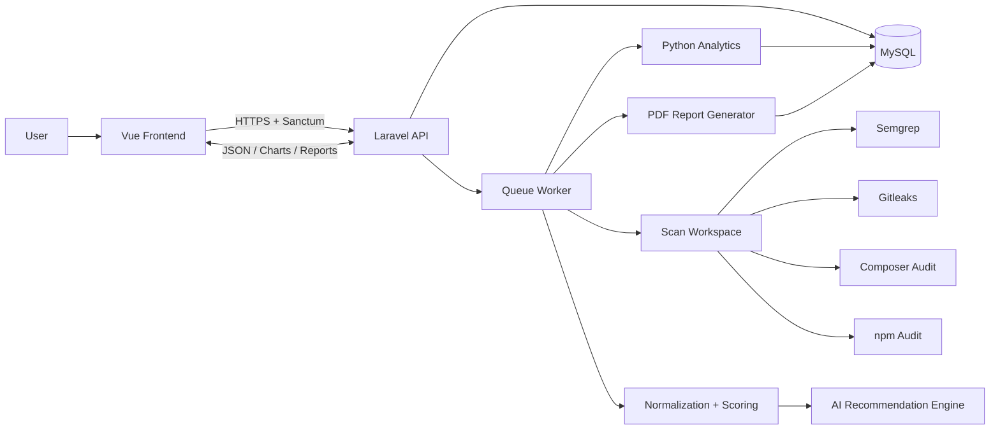
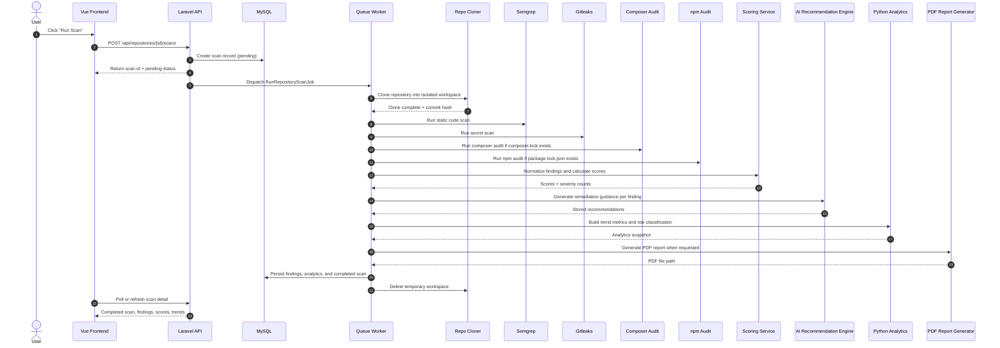

# AI-Powered GitHub Repository Security Analyzer

## Engineering Architecture

This document describes the end-to-end architecture for the security analyzer platform, including the backend API, frontend application, scanning pipeline, analytics layer, and deployment topology.

## 1. System Context

The platform allows an authenticated user to register one or more public GitHub repositories, trigger manual scans or configure recurring scans, and review vulnerability findings, remediation guidance, risk scores, trend analytics, and PDF reports.

The system is intentionally split into three execution domains:

1. Laravel backend for auth, repository management, scan orchestration, persistence, and API delivery.
2. Vue frontend for dashboard presentation and user interaction.
3. Python analytics module for historical trend processing and risk classification.

## 2. High-Level Component Model

```text
User
  -> Vue Frontend
  -> Laravel API
  -> MySQL
  -> Queue Worker
  -> Repository Clone Workspace
  -> Security Scanners
  -> Normalization / Scoring
  -> AI Recommendation Engine
  -> Python Analytics
  -> PDF Report Generator
```

### Mermaid Overview



### Scan Workflow Sequence



### Core Subsystems

#### Frontend

The frontend is a Vue 3 single-page application that:

- authenticates users
- lists repositories and scans
- renders findings and recommendations
- visualizes trend data in charts
- exposes report download actions

#### Backend API

The Laravel backend is the authoritative system of record. It:

- authenticates requests using Sanctum
- validates repository ownership
- creates and tracks scans
- dispatches scan jobs to the queue
- persists findings, recommendations, and analytics snapshots
- exposes dashboard and report APIs

#### Scan Worker

The queue worker executes asynchronous scan jobs. It:

- clones a repository into an isolated workspace
- runs the supported scanners
- normalizes scanner output into a common schema
- calculates scores
- stores findings and recommendations
- generates analytics records
- removes temporary scan artifacts

#### Python Analytics

The analytics module consumes scan history and produces:

- trend direction
- moving averages
- risk classification
- chart-ready series

#### Reporting

Reports are rendered from stored scan data into PDF documents and saved for authenticated download.

## 3. Runtime Flow

### 3.1 Authentication Flow

```text
Register / Login request
  -> Laravel validates payload
  -> User is created or authenticated
  -> Sanctum token is issued
  -> Frontend stores token and uses it for all API calls
```

### 3.2 Repository Registration Flow

```text
User submits GitHub repository URL and scan frequency
  -> Backend validates URL format and public GitHub constraint
  -> URL parser extracts owner and repository name
  -> Repository record is created for the authenticated user
  -> Schedule metadata is initialized
```

### 3.3 Manual Scan Flow

```text
User triggers scan
  -> Backend creates scan row with pending status
  -> Scan job is dispatched to queue
  -> Worker clones repository into storage/app/scans/{scan_id}/repo
  -> Worker captures commit hash
  -> Scanners run in isolation
  -> Results are normalized into findings
  -> Scores are calculated
  -> AI recommendations are generated
  -> Python analytics is executed or updated
  -> Scan is marked completed
  -> Workspace is deleted
```

### 3.4 Scheduled Scan Flow

```text
Scheduler runs every minute
  -> Backend finds repositories with is_scheduled = true
  -> next_scan_at <= now()
  -> Creates pending scan record
  -> Dispatches scan job
  -> Advances next_scan_at based on frequency
```

## 4. Data Flow

### 4.1 Primary Storage

MySQL stores all durable application state:

- users
- repositories
- scans
- findings
- AI recommendations
- scan analytics
- reports

### 4.2 Ephemeral Scan Storage

Each scan gets a temporary workspace at:

```text
storage/app/scans/{scan_id}/repo
```

This directory is used only during scan execution and is deleted after the job completes, regardless of success or failure.

### 4.3 Output Normalization

Each scanner produces its own output format. The backend converts all scanner results into a normalized finding contract:

- tool
- title
- description
- severity
- file path
- line number
- code snippet
- OWASP category
- CWE identifier
- risk score

This makes the frontend and report generator independent of scanner-specific schemas.

## 5. Security Boundaries

The design assumes the scanned repository is untrusted input.

### Hard Security Rules

- Never execute repository scripts.
- Never run `npm install`.
- Never run `composer install` inside the target repository.
- Never scan outside the safe clone workspace.
- Never store secrets in plain output.
- Delete clone artifacts after each scan.
- Use request authentication on every user-facing API.
- Enforce repository ownership checks on every resource lookup.
- Prefer Symfony Process over shell interpolation.
- Apply timeout limits to every external process.

### Protection Layers

#### API Layer

Sanctum tokens protect the API. The backend also enforces per-user ownership checks on repositories, scans, findings, and reports.

#### File System Layer

The clone workspace is isolated under `storage/app/scans`. It is not web-accessible and is removed after the scan completes.

#### Process Layer

All scanners run as child processes with explicit command arrays and configured timeouts.

#### Data Layer

All findings and recommendations are normalized before persistence, which prevents the frontend from depending on raw scanner output.

## 6. Scoring Model

### Inputs

The scoring engine consumes:

- critical findings
- high findings
- medium findings
- low findings
- secret detections
- dependency vulnerabilities
- code quality indicators

### Derived Scores

- Security score
- Secret score
- Dependency score
- Code quality score
- Overall health score

### Overall Health Formula

```text
Overall Health =
  Security Score * 0.40
  + Code Quality Score * 0.25
  + Dependency Score * 0.25
  + Secret Score * 0.10
```

### Risk Classification

The platform maps the overall health score to:

- Low Risk
- Medium Risk
- High Risk
- Critical Risk

## 7. Analytics Model

The analytics module is intentionally deterministic in the first implementation.

### Responsibilities

- compute trend direction from historical scan scores
- build moving averages for chart display
- classify repository risk from scan metrics
- prepare series for graph rendering

### Trend Direction Rule

```text
If the latest overall score is 5+ points higher than the previous score:
  Improving

If the latest overall score is 5+ points lower than the previous score:
  Worsening

Otherwise:
  Stable
```

## 8. Recommendation Generation

The recommendation layer converts a finding into a structured remediation response:

- plain English summary
- business impact
- technical explanation
- recommended fix
- secure code example

The first version is deterministic and safe. It can later be replaced by an OpenAI-powered implementation without changing the surrounding API contract.

## 9. Deployment Topology

```text
Docker Compose
  - app
  - queue
  - scheduler
  - nginx
  - mysql
  - frontend
```

### Container Responsibilities

#### app

Runs Laravel behind PHP-FPM and serves API requests through Nginx.

#### queue

Processes scan jobs asynchronously.

#### scheduler

Runs Laravel scheduler every minute and enqueues due scans.

#### nginx

Serves the Laravel public entrypoint and proxies requests to PHP-FPM.

#### mysql

Stores durable application data.

#### frontend

Runs the Vue development server during local development.

## 10. Local Bootstrap Flow

The backend container entrypoint performs first-run setup:

```text
container starts
  -> copy .env.example if .env is missing
  -> create required storage directories
  -> run composer install if vendor/ is absent
  -> generate APP_KEY if needed
  -> optionally run migrations
  -> start the container process
```

This makes the stack closer to a real developer onboarding flow instead of requiring manual setup steps before the app can boot.

## 11. Suggested Request Path

```text
Browser
  -> Vue route
  -> Axios request with Bearer token
  -> Laravel controller
  -> domain service
  -> model / job / scanner pipeline
  -> database or report file
  -> JSON response
  -> Vue state update
```

## 12. Failure Modes

### Repository Validation Failure

If the URL is not a public GitHub repository URL, the request is rejected before any scan work begins.

### Clone Failure

If cloning fails, the scan is marked failed and the workspace is cleaned up.

### Scanner Failure

If one scanner fails, the scan job records the error, preserves any available state, and surfaces the failure to the user.

### Report Failure

If report generation fails, the scan remains queryable and the report error is isolated to the report creation path.

## 13. Implementation Notes

- The system is designed to be modular so scanners can be swapped or expanded.
- The queue-based scan architecture keeps UI requests fast.
- The normalized finding schema is the key integration contract between scanners, analytics, and the frontend.
- The first release prioritizes safe static analysis over executing any repository code.

## 14. Summary

The platform is a secure, queue-driven repository scanning system with a Laravel API, Vue dashboard, Python analytics, and Docker-based local runtime. The architecture is centered around isolated scan execution, normalized findings, durable scan history, and repeatable trend analysis.
